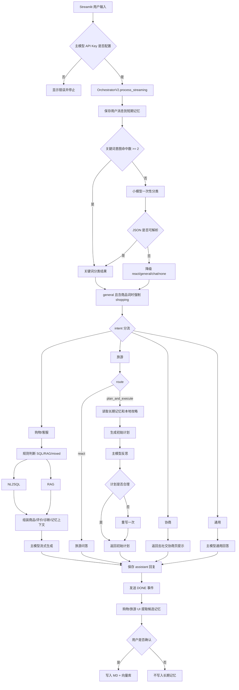
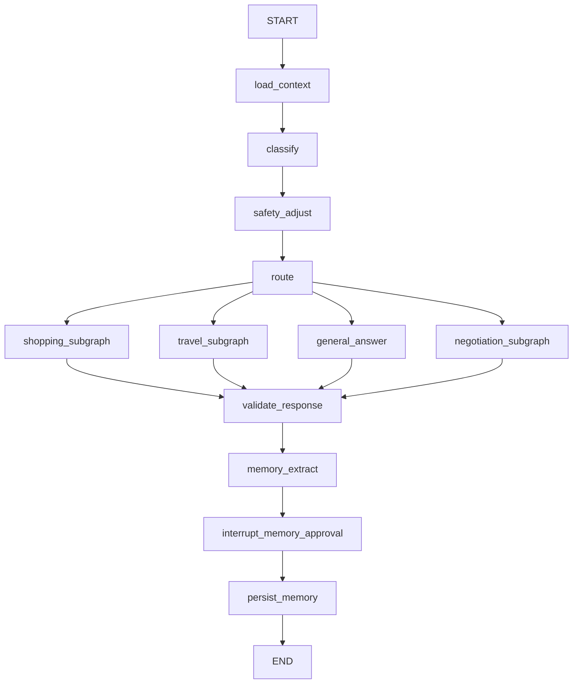

# SmartLife Agent 当前编排、问题清单与 LangGraph 改造交接文档

> 文档目的：把这个仓库当前的真实运行方式、所有已知问题、修复建议和 LangGraph 改造方案完整交给下一个 AI 或开发者。  
> 生成日期：2026-10-05  
> 项目根目录：`/Volumes/TUF ESD-T1A Media/xagent/smartlife-agent`  
> 状态：代码审查结论，尚未修改业务代码。当前 shell 没有可用的 Python 项目依赖和 pytest，因此本文中的运行时结论来自静态代码审查，不代表已经通过端到端测试。

---

## 0. 下一个 AI 必须先知道的结论

1. 当前实际入口是 `app/main.py`，真正执行的编排器是 `app/agents/orchestrator_v2.py` 的 `OrchestratorV2`。
2. `app/agents/orchestrator.py` 是旧版兼容实现，当前 Streamlit 页面没有调用它。
3. 当前系统不是完整的 ReAct、Plan & Execute、MCP 多智能体系统。这些名字已经出现在代码或设计文档中，但执行语义没有完整落地。
4. 当前主流程实际是：
   `输入 -> 短期记忆 -> 分类 -> 固定意图分支 -> SQL/RAG/本地资料 -> 主模型生成 -> DONE -> 用户确认记忆`
5. 当前最严重的功能断点是：
   - API Key 明文写入 Git 跟踪的配置文件；
   - `session_id=default` 导致会话/用户上下文隔离失败；
   - RAG 调用了一个不存在的方法；
   - ReAct 没有工具循环；
   - Plan & Execute 没有真正执行器；
   - 协商图没有接进 UI，而且调用了一个不存在的方法。
6. `langgraph>=0.1.0` 已写入 `requirements.txt`，仓库也已经有 `app/negotiation/graph.py` 的 `StateGraph` 示例，但当前环境没有安装项目依赖，没有锁文件，不能确认实际安装版本。
7. 推荐使用 LangGraph 作为顶层控制流和状态运行时，但先修复 P0 问题，再迁移。不要把 LangGraph 当成“包好现成 Agent 的组件库”；它主要提供图式编排、状态、分支、循环、checkpoint 和 human-in-the-loop 能力。

---

## 1. 代码边界：哪些是当前事实，哪些是历史/设计

### 1.1 当前实际调用路径

| 层级 | 文件 | 当前作用 |
|---|---|---|
| UI | `app/main.py` | Streamlit 页面、事件渲染、用户确认记忆 |
| 主编排 | `app/agents/orchestrator_v2.py` | 分类、分支、检索、生成、记忆接口 |
| 分类 | `app/classifier.py` | 关键词分类和小模型统一分类 |
| 购物检索 | `app/retrieval/nl2sql.py`、`app/retrieval/rag.py` | 商品 SQL 和语义资料检索 |
| 旅游 | `app/agents/travel_agent.py` | 问答、计划、反思、重写 |
| 短期记忆 | `app/memory/short_term.py` | 进程内会话消息 |
| 长期记忆 | `app/memory/long_term.py` | Chroma 向量召回 |
| MD 记忆 | `app/memory/md_memory.py` | 人类可读的偏好/事件文件 |
| 候选提取 | `app/memory/extractor.py` | 小模型提取待确认事实 |
| 配置 | `app/config.py` | 主模型、小模型、Embedding 配置 |

### 1.2 当前没有进入主流程的代码

| 文件/能力 | 状态 | 说明 |
|---|---|---|
| `app/agents/orchestrator.py` | 旧版 | 创建 MCP server、工具集合和旧版意图/路由双调用，但 UI 不使用 |
| `app/agents/shopping_agent.py` | 当前流式主链路不使用 | 它使用 `HybridRetriever`，而 `OrchestratorV2` 自己实现了一套检索 |
| `app/retrieval/fusion.py` | 当前流式主链路不使用 | 有 SQL + RAG + Rerank 融合，但 V2 没调用 |
| `app/retrieval/reranker.py` | 当前流式主链路不使用 | Cross-Encoder 只被 `HybridRetriever` 使用 |
| `app/agents/reflection.py` | 当前流式主链路不使用 | 旅游实际使用 `travel_agent.py` 内联反思 prompt |
| `app/mcp_servers/*` | 未接入 | 只在旧 orchestrator 和测试中注册 |
| `app/tools/*` | 未接入 | 天气、地图、支付、时间只是 LangChain tool 定义 |
| `project-design-v5.md` | 设计文档 | 描述目标架构，不等于当前实现 |

判断原则：**当设计文档、类名和实际调用链冲突时，以 `app/main.py -> OrchestratorV2` 的调用链为准。**

---

## 2. 当前完整运行流程



### 2.1 分类层的真实判断

文件：`app/classifier.py`

1. 第一层 `_keyword_classify()`：
   - `route`：命中“规划、计划、清单、安排、预算分配、行程、准备、策划、方案、统筹、编排、设计路线”等词时候选设为 `plan_and_execute`。
   - `intent`：对 shopping、travel、negotiation、customer_service 的关键词做命中数统计。
   - 只有最大意图命中数 `>= 2`，本层才返回结果。
   - shopping 默认 `retrieval=mixed`，travel 默认 `rag_only`。
2. 第二层 `UnifiedClassifier`：
   - 只在关键词层返回空时调用小模型。
   - 一次输出 `route`、`intent`、`sub_intent`、`retrieval`、`confidence`、`reason`。
   - JSON 解析失败时降级为 `react/general/chat/none`。
3. Orchestrator 安全网：
   - `general` 但包含商品、价格、预算、推荐等词时强制改为 `shopping/search/mixed`。

注意：`confidence` 当前只用于展示，不参与阈值、升级或人工确认。

### 2.2 购物/客服分支

文件：`app/agents/orchestrator_v2.py::_run_shopping_streaming()`、`_classify_data_needs()`、`_smart_retrieve()`

1. 先用关键词规则推导数据需求：
   - 商品数据默认需要；
   - 出现评价、口碑、质量、体验、好不好、怎么样等词时增加评价需求；
   - 如果评价词至少 2 个且没有商品/属性词，则只查评价。
2. 重新决定策略：
   - 商品 + 评价 -> `mixed`
   - 只商品 -> `sql_only`
   - 只评价 -> `rag_only`
3. SQL：
   - 小模型用 `with_structured_output(SQLQuery)` 生成 SQL；
   - 只检查 SQL 是否以 `SELECT` 开头；
   - 直接执行到 `data/products.db`；
   - 空结果或异常时使用关键词扩展和数字价格生成模糊 SQL。
4. RAG：
   - 调用 `RAGRetriever.retrieve(query, k=5)`；
   - **当前 `RAGRetriever` 没有 `retrieve()` 方法，因此实际进入异常分支。**
5. 长期记忆：
   - 固定查询“旅行 目的地 景点 活动 户外”；
   - 召回 5 条，拼接前 3 条。
6. 主模型生成：
   - 上下文包括商品、评价、检索诊断、历史偏好和最近 10 条短期对话；
   - prompt 限制只能推荐真实商品，不能伪造评价。

### 2.3 旅游分支

文件：`app/agents/travel_agent.py`

#### react

- 读取固定跨场景记忆；
- 主模型直接回答；
- 不使用短期聊天历史、SQL、RAG、本地攻略或外部工具。

#### plan_and_execute

1. 读取跨场景购物记忆；
2. 读取本地 `data/guides/*.txt`；
3. 主模型生成初始计划；
4. 主模型审核时间、预算、地理、用餐休息和天气；
5. 如果审核不满意，再重写一次；
6. 返回最终文本。

它不是完整的 Plan & Execute，因为没有：

- 将计划转成结构化 step/task；
- 逐项执行 step；
- 根据工具结果更新执行状态；
- 多轮 should_continue；
- 动态 replanning；
- 对修订结果再次反思。

### 2.4 通用和协商分支

- general：使用最近 5 条短期历史，由主模型直接生成。
- negotiation：当前 `process_streaming()` 只返回“请在社交协商标签页配置”的提示。
- `process_negotiation_streaming()` 没有被 UI 调用。
- `_do_negotiation()` 调用 `self.negotiation_graph.run_streaming(...)`，但 `NegotiationGraph` 只有 `negotiate()`，没有 `run_streaming()`。
- 即使调用图，`_generate_plan()` 也只返回 `status/messages`，没有真正生成协商方案文本。

### 2.5 记忆流程

#### 短期记忆

- 每轮保存 user 和 assistant；
- 单个 session 最多 50 条；
- 购物/通用读取最近 10 条；
- 旅游规划不读取短期历史；
- UI 的购物、旅游和社交页都传入默认 `session_id="default"`；
- `OrchestratorV2` 是模块级全局实例。

#### 候选记忆

- 购物/旅游每轮结束后，小模型读取整个短期历史；
- 只要求提取事实，不推断偏好；
- 前端显示候选，用户可以选中、全部保存或拒绝。

#### 长期记忆

- 用户确认后写入两处：
  - MD：`preferences.md` 或 `events.md`；
  - Chroma：`memory_db`。
- shopping/travel 类别写 MD event；
- 其他类别写 MD preference；
- 向量侧统一调用 `save_summary()`，因此向量 metadata 的 `type` 都是 `summary`。

#### 手动压缩

- 个人中心读取短期历史，小模型生成摘要；
- 用户确认后写入 MD + 向量库；
- 当前不会自动每 20 条压缩。

---

## 3. 问题总表

| ID | 优先级 | 问题 | 影响 |
|---|---|---|---|
| ISS-001 | P0 | API Key 明文写入 Git 跟踪文件 | 密钥泄露、凭据轮换困难 |
| ISS-002 | P0 | 会话身份和全局内存不隔离 | 用户/标签页上下文互相污染 |
| ISS-003 | P0 | RAG 调用不存在的 `retrieve()` | 评价/攻略语义检索实际失败 |
| ISS-004 | P0 | ReAct 没有工具循环 | 无法根据工具结果继续推理 |
| ISS-005 | P0 | Plan & Execute 没有执行器 | 复杂任务只是单次文本规划 |
| ISS-006 | P0 | 协商图未接入且 API 缺失 | 社交协商主功能不可用 |
| ISS-007 | P1 | route 字段语义分裂 | 同一个 route 在不同意图中效果不同 |
| ISS-008 | P1 | 分类只看当前消息且规则脆弱 | 多轮指代、边界表达容易误判 |
| ISS-009 | P1 | 检索架构重复，Rerank 被绕开 | 两套检索实现漂移，排序能力未生效 |
| ISS-010 | P1 | 旅游上下文和工具不完整 | 计划缺少对话上下文和实时数据 |
| ISS-011 | P1 | 反思/修订缺少闭环 | 修订可能丢失计划基线，且不复审 |
| ISS-012 | P1 | MD 与向量记忆不一致 | 编辑/删除后旧向量继续被召回 |
| ISS-013 | P1 | 记忆提取无去重/去噪，重复提取 | 候选重复、长期记忆膨胀 |
| ISS-014 | P1 | 手动压缩保存按钮不可达 | Streamlit 嵌套按钮生命周期导致保存操作无法触发 |
| ISS-015 | P1 | SQL 安全校验不足 | LLM SQL 只检查 SELECT 前缀，模糊 SQL 还是字符串拼接 |
| ISS-016 | P1 | 跨场景记忆查询固定且不按问题检索 | 可能召回无关偏好，污染生成 |
| ISS-017 | P1 | 异常被宽泛吞掉 | 初始化、分类、记忆失败难以定位 |
| ISS-018 | P1 | 同步/异步实现漂移 | 旅游同步反思最多 3 次，流式只重写 1 次 |
| ISS-019 | P1 | 依赖不可复现 | 无 lockfile、下界过宽，当前环境甚至未安装依赖 |
| ISS-020 | P1 | 测试没有覆盖真实主链路 | 现有测试多为 import/tool model 测试 |
| ISS-021 | P2 | UI 步骤标签不等于真实执行 | Step 4 由前端手工添加，容易误导 |
| ISS-022 | P2 | 旧版、设计稿和 V2 并存 | 下一个维护者容易改错层 |

---

## 4. 问题详细说明

### ISS-001：API Key 明文写入 Git 跟踪文件（P0）

**上下文**

`app/config.py` 的 `CONFIG_FILE` 指向：

```text
smartlife-agent/data/config.json
```

`_save_config()` 会把 `_main`、`_small`、`_embedding` 三组配置原样 JSON 序列化，其中包含：

```text
api_key
base_url
model
```

`git ls-files smartlife-agent/data/config.json` 已确认该文件被 Git 跟踪，文件权限为普通可读文件。

**影响**

- API Key 可能进入 Git 历史；
- 分享仓库、打包代码、提交截图或复制项目时可能泄露；
- 不能依赖“当前文件里是否为空”判断安全，因为历史版本也可能包含密钥；
- 未来做 CI、容器、多人协作时会把本地配置当成代码。

**修复建议**

1. 立即检查并轮换曾经写入过的所有主模型、小模型、Embedding API Key。
2. 把配置改成环境变量或本地 secret store。
3. `config.json` 只保存非敏感配置，例如 base_url/model；API Key 不落盘。
4. 将 `data/config.json` 移出 Git，增加 `.gitignore`，并清理 Git 历史中的敏感版本。
5. 前端只允许会话内存中的临时配置，不要把 password input 内容自动持久化到仓库文件。

**验收**

- 仓库当前和历史中都找不到真实 API Key；
- 保存配置后磁盘上不出现明文 `api_key`；
- CI/测试无需真实 Key，使用 mock 或环境变量。

---

### ISS-002：会话身份和全局内存不隔离（P0）

**上下文**

- `app/main.py` 调用 `orch.process_streaming(prompt, _uid)`，没有传 `session_id`；
- `OrchestratorV2` 的便捷函数默认 `session_id="default"`；
- `get_orchestrator_v2()` 使用模块级 `_orchestrator_v2` 全局单例；
- `ShortTermMemory` 是单例中的普通 Python 字典；
- 购物、旅游、社交页共用 `default`；
- UI 自己又分别维护 `shopping_msgs`、`travel_msgs`、`social_msgs`。

**影响**

- 不同标签页的历史混在同一短期记忆；
- 不同 Streamlit 浏览器会话/用户可能共享全局 orchestrator；
- 记忆提取会读取不属于当前用户或当前场景的完整历史；
- 后续 LangGraph 如果继续复用该对象，会把状态污染带到 checkpoint。

**修复建议**

1. 每次请求都显式传：
   `thread_id = f"{user_id}:{scene}:{session_id}"`。
2. 前端为每个浏览器会话生成随机 `session_id`。
3. 短期状态改为按 `user_id/session_id` 隔离的 store，不放在全局 Python 字典。
4. 记忆提取只接收本次会话/本次上下文，而不是任意 `default`。
5. 为多用户情况增加并发测试。

**验收**

- 两个 user_id、两个 session_id 的消息互不可见；
- 购物页和旅游页可以选择共享或隔离；
- 重启 Streamlit 后行为符合配置，不发生未定义的跨用户读取。

---

### ISS-003：RAG 调用不存在的 `retrieve()`（P0）

**上下文**

`app/agents/orchestrator_v2.py` 中：

```python
rag = RAGRetriever()
rag_result = rag.retrieve(query, k=5)
```

但 `app/retrieval/rag.py` 中只实现：

```python
def search(...)
def search_with_score(...)
```

没有 `retrieve()`。

`_smart_retrieve()` 捕获异常后只是写入 `diagnostics`，流程继续生成回答。

**影响**

- 评价、口碑、攻略等 RAG 语义内容在 V2 主链路中不可用；
- mixed 查询实际只剩 SQL；
- prompt 会得到“RAG 异常”，而不是真实证据；
- 用户看到的检索过程卡可能显示了 RAG，但结果为空；
- 如果主模型不遵守提示，可能用自己的知识补评价，产生幻觉。

**修复建议**

优先统一检索 API，不要只做一行改名：

1. 让 `OrchestratorV2` 复用 `HybridRetriever`；
2. 或给 `RAGRetriever` 增加统一 `retrieve(query, k) -> RetrievalResult`；
3. 明确返回结构：`documents`, `scores`, `diagnostics`, `source`；
4. 对 RAG 失败设置显式状态，禁止无证据生成评价；
5. 增加真实调用测试。

**验收**

- `rag_only` 能返回至少一条真实文档；
- `mixed` 同时包含 SQL 商品和 RAG 文档；
- 故意删除向量库时，UI 明确降级，不展示虚假评价；
- 主链路测试覆盖 `retrieve/search` 接口。

---

### ISS-004：ReAct 没有真正的 Thought-Action-Observation 循环（P0）

**上下文**

`ShoppingAgent` 的类名和注释写着 ReAct，但 `OrchestratorV2._run_shopping_streaming()` 是固定流程：

```text
分类 -> 数据需求 -> SQL/RAG -> 拼 prompt -> 主模型一次性生成
```

没有：

- `bind_tools()`；
- ToolNode / tool executor；
- tool_calls 循环；
- observation 写回模型；
- stop/continue 条件；
- 最大迭代次数；
- 工具错误后的推理重试。

天气、地图、支付、时间和 MCP 工具只定义未接入。

**影响**

- 不能处理“先查天气再决定穿什么”“查库存后换商品”“调用支付再返回订单号”等需要多步工具的任务；
- UI 上的 `tool_call` 只是事件展示标签；
- 系统无法根据工具结果改变计划；
- ReAct 面试概念与实际实现不一致。

**修复建议**

两种方式二选一：

1. 使用 LangGraph 自定义：
   `agent -> should_continue -> tools -> agent -> should_continue ...`
2. 使用 LangGraph 预构建的 ReAct/ToolNode 能力，但要按锁定版本的官方 API 接入。

要求：

- 统一 Tool schema；
- tool node 只执行工具，不混入业务 prompt；
- observation 作为 state 更新；
- 设置最大步数、超时、错误重试；
- 明确支付等敏感工具的 human approval。

**验收**

- 至少一个多步工具测试：模型先调用工具，再根据结果回答；
- 工具失败时模型能收到 observation 并降级；
- 超过最大步数能安全终止；
- 支付、删除等敏感操作必须人工确认。

---

### ISS-005：Plan & Execute 没有真正 Execute（P0）

**上下文**

`route=plan_and_execute` 只在旅游意图中生效：

```python
if classification.route == "plan_and_execute":
    response_text = await self.travel_agent.plan_trip_streaming(...)
```

旅游流式实现是：

```text
生成计划 -> 反思 -> 必要时重写一次
```

没有结构化 Plan、Step、Executor、状态更新和动态 Replan。

另外，prompt 说可以查天气、搜酒店、规划路线、计算预算，但没有实际调用对应工具。

**影响**

- 复杂的“购物清单 + 行程 + 预算”不能真正分步执行；
- 计划可能依赖模型知识编造天气/酒店/价格；
- 用户无法看到“执行第几步”；
- 没有步骤级成功/失败；
- `route` 名称容易让维护者误以为已有执行框架。

**修复建议**

把旅行任务拆成 LangGraph 子图：

```text
make_plan -> validate_plan -> execute_step -> should_continue
          -> reflect -> needs_revision? -> replan -> finalize
```

每个 step 是结构化对象：

```python
class PlanStep(TypedDict):
    id: str
    action: str
    tool: str | None
    args: dict
    status: str
    result: Any
```

预算、地点、天气、酒店、购物清单都通过受控工具或检索获取。不要让主模型直接声称已经查询了数据。

**验收**

- 一个计划包含多个结构化 step；
- 每个 step 有状态和结果；
- 工具失败会触发 fallback/replan；
- 最终答案引用真实工具/检索结果；
- 至少一次人工确认节点。

---

### ISS-006：协商图未接入，而且 API 缺失（P0）

**上下文**

- `app/main.py` 社交协商页调用 `process_streaming()`；
- `process_streaming()` 对 `intent=negotiation` 只返回提示语；
- `process_negotiation_streaming()` 没有 UI 调用者；
- `_do_negotiation()` 调用 `NegotiationGraph.run_streaming()`；
- `NegotiationGraph` 只有 `negotiate()`，没有 `run_streaming()`；
- `_generate_plan()` 只返回 status/messages，不生成方案。

**影响**

- 社交协商标签页不是真正协商；
- 如果未来接入 `process_negotiation_streaming()`，会立即触发 `AttributeError`；
- 多人偏好、共同点、冲突解决无法形成最终可执行方案；
- 这是“图已经写了一半但没有接线”的典型问题。

**修复建议**

1. 让 UI 明确调用协商子图；
2. 统一同步/异步 API：`invoke()`、`ainvoke()`、`stream()` 或 `astream()`；
3. `generate_plan` 返回结构化方案和文本；
4. 为每个参与者补充真实 user_id/记忆查询；
5. 将预算冲突、风格冲突和投票/确认做成 conditional edge。

**验收**

- UI 能进入协商图；
- 有/无冲突分别走正确分支；
- 最终返回可读方案；
- 多用户记忆按 user_id 隔离；
- async 流式测试通过。

---

### ISS-007：route 字段语义分裂（P1）

**上下文**

`route` 的 prompt 定义是通用的复杂任务策略，但实际代码只在 `intent=travel` 时读取：

```python
if classification.route == "plan_and_execute":
```

购物、客服、通用和协商不根据 route 切换执行器。

**影响**

- 小模型可以输出 `plan_and_execute`，但购物任务不会真正规划；
- “跨场景购物+旅行”没有对应分支；
- route、intent、retrieval 三套决策没有统一模型；
- 测试无法根据 route 预测行为。

**修复建议**

把 route 重命名为 `execution_mode`，并明确枚举：

```text
direct_answer
tool_react
plan_execute
human_confirmation
```

每个 intent 只声明允许的 execution_mode，并由顶层图路由。不要让字段含义依赖具体子 Agent。

---

### ISS-008：分类只看当前消息，关键词优先级脆弱（P1）

**上下文**

分类输入只有当前 `user_message`，没有最近对话。关键词层要求至少 2 个词命中；安全网再覆盖 general。`confidence` 不参与后续判断。

**影响**

- “第二个呢”“预算改成 800”“就按刚才那个”容易误分类；
- “帮我看看这个”可能没有关键词命中；
- 同一词在多个意图中重复，例如“规划”“行程”“预算”；
- 关键词结果 confidence 固定 0.85，没有校准；
- 规则、小模型和安全网可能互相覆盖。

**修复建议**

- 分类输入加入最近 N 条消息和上一轮分类；
- 保留规则作为快速路径，但只用于高置信度；
- 低置信度进入小模型或澄清节点；
- 用测试集评估关键词、小模型、安全网的优先级；
- 把分类结果和证据写入 state，便于调试。

---

### ISS-009：检索架构重复，Rerank 没有在 V2 生效（P1）

**上下文**

仓库同时存在：

1. `ShoppingAgent + HybridRetriever + CrossEncoderReranker`
2. `OrchestratorV2._smart_retrieve + NL2SQLChain + RAGRetriever`

V2 不使用 `HybridRetriever`，因此没有融合、product_id 关联、Cross-Encoder 精排和统一错误返回。

**影响**

- 修改一个检索实现，另一个不生效；
- Reranker 代码“存在但不执行”；
- 商品和评价的关联逻辑可能失效；
- 难以编写统一检索测试；
- 工程上看像有混合检索，实际没有。

**修复建议**

确定唯一入口 `RetrievalService`：

```text
retrieve(query, mode) -> RetrievalResult
```

内部负责 SQL、RAG、融合、Rerank、诊断和 fallback。Agent 只调用这个 service，不直接实例化 NL2SQL/RAG。

---

### ISS-010：旅游上下文和外部工具不完整（P1）

**上下文**

旅游规划读取长期记忆和本地攻略，但没有短期聊天历史。prompt 声称能查天气、酒店、路线，实际工具未绑定。

**影响**

- 多轮旅行对话无法继承“人数、日期、预算、出发地”；
- 用户修改条件时可能覆盖或忽略上一轮；
- 天气、酒店、路线是模型生成，不是真实数据；
- 本地攻略关键词固定，且无匹配时直接取前几份，可能无关。

**修复建议**

- 将当前会话、上一轮计划、结构化偏好加入 state；
- 将攻略检索改为向量检索 + rerank；
- 天气、酒店、路线接入真实工具或明确标注不可用；
- 对缺失字段进入 clarification 节点，而不是让模型猜测。

---

### ISS-011：反思和修订缺少闭环（P1）

**上下文**

流式旅行链路：

```text
current_plan -> reflect -> if revision: revise -> return revised_plan
```

重写 prompt 只包含原始请求和审核意见，没有完整 `current_plan`。重写后不再反思。同步接口最多反思 3 次，流式接口只修订 1 次。

**影响**

- 修订结果可能是从头生成，而不是局部改进；
- 初始计划和修订计划的差异不可追踪；
- 修订可能引入新问题，但不会再次检查；
- 同步/流式行为不一致；
- UI 会先流式显示初始计划，再显示修订文本，用户看到重复内容。

**修复建议**

state 保存：

```text
original_request
plan_versions[]
reflection
revision_count
final_plan
```

反思输出使用结构化 schema；修订必须输入上一版完整计划；修订后重新反思，达到最大次数后强制返回 best_effort，并记录未解决问题。

---

### ISS-012：MD 与向量记忆不一致（P1）

**上下文**

写入时同时写 MD 和向量库，但：

- `MDMemory.delete_memory()` 只删 MD/index；
- `MDMemory.update_memory()` 只改 MD/index；
- 向量条目没有对应 memory_id 删除/更新；
- 向量保存统一调用 `save_summary()`，metadata 类型与 MD event/preference 不一致。

**影响**

- 删除记忆后旧向量仍会被召回；
- 编辑后模型仍读到旧内容；
- MD 看起来是权威源，但向量库是独立副本；
- 无法审计同一条记忆的两份数据是否一致。

**修复建议**

- 为每条记忆生成稳定 `memory_id`，两边都写；
- MD 写入、更新、删除都同步向量 CRUD；
- 向量 metadata 使用 `memory_id`, `memory_type`, `category`, `source`, `version`；
- 增加一致性校验任务；
- 决定唯一权威源和索引源。

---

### ISS-013：记忆提取没有完整去重/去噪（P1）

**上下文**

`MemoryExtractor` 主要做 JSON 格式解析和字段校验。没有：

- 与既有长期记忆去重；
- 候选之间去重；
- 事实/意见/推测分类；
- 低价值内容过滤；
- 重复提取阻断；
- 用户已拒绝候选的记忆。

**影响**

- 每轮对完整历史重新提取，可能重复展示相同事实；
- 用户多次保存会重复写入；
- 模型生成的解释也可能被当成用户事实；
- 长期记忆膨胀，向量召回质量下降。

**修复建议**

- 只对新增 assistant/user 消息提取，或记录 `last_extracted_message_id`；
- 写入前做语义去重；
- 明确事实来源字段；
- 记录 rejected candidate；
- 对记忆数量、长度、类别设限制。

---

### ISS-014：手动压缩保存按钮不可达（P1）

**上下文**

`app/main.py` 中：

```python
if st.button("压缩当前对话"):
    ...
    if st.button("保存压缩结果"):
```

Streamlit button 只在用户点击并触发 rerun 的那一次返回 True。内层保存按钮在下一轮 rerun 时，外层压缩按钮已经返回 False，因此内层不会执行。

**影响**

- 点击压缩可以显示摘要，但无法通过预期按钮保存；
- 用户可能误以为已经保存；
- 这是 UI 状态管理问题，不是模型问题。

**修复建议**

- 把摘要写入 `st.session_state["pending_summary"]`；
- 下一轮根据 pending_summary 显示独立保存按钮；
- 或使用 form 一次性提交；
- 为 UI 写 Streamlit AppTest 测试。

---

### ISS-015：SQL 安全校验不足（P1）

**上下文**

NL2SQL 只验证 SQL 以 `SELECT` 开头，然后直接执行模型输出。提示词说“参数化查询”，但模糊 SQL 是字符串拼接。

**影响**

- 复杂/多语句/非预期 SELECT 可能被执行；
- 可访问 schema 中允许之外的表或字段；
- LLM 输出包含注释、尾随语句时检查不可靠；
- 价格数字被直接拼接进 SQL；
- 缺少查询超时、行数限制、字段 allowlist。

**修复建议**

- 使用 SQL parser/AST 校验；
- 只允许 SELECT、指定表/列；
- 禁止 PRAGMA、ATTACH、事务、多语句；
- 所有值参数化；
- 使用只读 DB 连接；
- 设置 query timeout、max_rows、成本限制；
- 对模型 SQL 做静态 allowlist。

---

### ISS-016：跨场景记忆查询固定且不按当前问题检索（P1）

**上下文**

```text
travel -> recall("购物 装备 商品 购买 户外", k=5)
shopping -> recall("旅行 目的地 景点 活动 户外", k=5)
```

然后固定取前 3 条。

**影响**

- 用户问手机时，可能召回露营偏好；
- 固定查询不能表达用户当前问题；
- 记忆没有时间衰减、冲突消解或可信度；
- `recall()` 降级方案按 query.split() 对中文几乎无效。

**修复建议**

- 使用 `current_query + scene + structured_preferences` 构造检索；
- metadata 过滤 category/type/time；
- 对召回记忆评分、去重、冲突消解；
- 没有高相关记忆时不硬塞上下文；
- 为中文降级检索实现分词或 n-gram。

---

### ISS-017：异常被宽泛吞掉，可观测性不足（P1）

**上下文**

大量 `except Exception: pass` 或只打印 warning。长期记忆初始化失败会降级为进程内字典，但不同 Agent 可能各持有一个实例。分类、记忆、RAG 的错误只写简短诊断或 print。

**影响**

- 线上无法知道哪个组件失败；
- 降级成功和降级失败混在一起；
- 不同对象的 fallback store 互不共享；
- 用户得到答案，但不知道证据缺失；
- 日志不能关联 request/user/session/thread。

**修复建议**

- 使用结构化日志；
- 每次请求生成 request_id/thread_id；
- 把 error_code、component、fallback_mode 写入 state；
- 降级必须显式返回 status；
- 关键失败不得静默继续；
- 接入 tracing/metrics。

---

### ISS-018：同步/异步实现漂移（P1）

**上下文**

旅游同步 `plan_trip()` 最多 3 轮反思；流式 `plan_trip_streaming()` 只修订一次。购物同步走 `ShoppingAgent + HybridRetriever`，流式走另一套 `_smart_retrieve`。旧 orchestrator 和 V2 也有不同记忆逻辑。

**影响**

- 同一个问题在 API 和 UI 上行为不同；
- 测试同步路径无法代表生产流式路径；
- 修复一处另一处继续出错；
- 代码审查难以判断哪个实现是规范。

**修复建议**

- 只保留一个 domain/service 层；
- 同步和异步只是 adapter；
- 删除旧 orchestrator 或明确标记 deprecated；
- 回归测试必须分别调用 UI 主路径和公共 API。

---

### ISS-019：依赖不可复现（P1）

**上下文**

`requirements.txt` 只有下界，没有 lockfile。示例：

```text
langgraph>=0.1.0
langchain>=0.2.0
```

当前 shell 中 `langgraph`、`langchain`、`langchain_core` 都不可导入，仓库也没有 `.venv`、`poetry.lock`、`uv.lock`、`Pipfile.lock`。

**影响**

- 下一次安装可能得到不同大版本；
- LangGraph API/checkpointer/tool API 可能随版本变化；
- 无法稳定复现 bug；
- 测试环境和运行环境不确定；
- 无法确认当前代码使用的实际 LangGraph 版本。

**修复建议**

1. 选定 Python 版本；
2. 建立 venv；
3. 用 uv/poetry/pip-tools 生成 lockfile；
4. 固定 LangChain、LangGraph、Chroma、sentence-transformers 的兼容版本；
5. CI 使用 lockfile；
6. 增加版本兼容测试。

---

### ISS-020：测试没有覆盖真实主链路（P1）

**上下文**

现有测试主要验证：

- import；
- Pydantic model；
- tool function 返回；
- MCP get_tools 数量；
- 简单 memory 方法。

没有完整覆盖：

- keyword -> small model fallback；
- route 分流；
- RAG 成功/失败；
- SQL fallback；
- 旅游 reflect/revise；
- session 隔离；
- memory 用户确认；
- Streamlit UI；
- 协商图；
- streaming event 顺序。

而且当前 shell 没有 pytest 命令。

**修复建议**

分层测试：

1. 纯函数单测；
2. service 集成测试，mock LLM；
3. graph 流程测试；
4. 数据库/向量集成测试；
5. Streamlit AppTest；
6. 真实模型 smoke test。

---

### ISS-021：UI 步骤标签不完全代表真实执行（P2）

`app/main.py` 在响应结束后手工 append Step 4“记忆提取”，但 Orchestrator 的事件流不一定包含统一 Step 1-4。旅游分支主要是 thinking/token/tool_call，不是同一套 STEP 事件。

**影响**

- 用户把展示标签理解为完整执行日志；
- 调试时难以从 UI 还原真实状态；
- 不同分支步骤数不一致。

**修复建议**

所有节点由图/state 产生结构化 event：

```text
event_id, request_id, node, status, started_at, ended_at, input_ref, output_ref, error_code
```

UI 只渲染事实，不自行补步骤。

---

### ISS-022：旧版、V2 和设计文档并存（P2）

`project-design-v5.md` 描述 MCP 动态发现、ReAct、Plan & Execute 等目标能力；旧 orchestrator 也有部分实现，但 V2 是当前路径。

**影响**

- 下一个 AI 可能改旧代码却看不到效果；
- 测试可能测试未调用组件；
- 架构表述与真实能力不一致。

**修复建议**

- 给旧文件加明确 deprecated 注释；
- 文档区分 Current / Target / Removed；
- 删除重复实现，或建立 ADR；
- 每个组件写 owner、入口和 active caller。

---

## 5. 推荐修复顺序

### 阶段 A：先止血

1. 轮换密钥，移出 `config.json`，清理 Git 历史。
2. 引入唯一 `user_id/session_id/thread_id`。
3. 修复 RAG 接口，确定唯一 RetrievalService。
4. 建立 Python venv 和 lockfile。
5. 补 P0 集成测试。

### 阶段 B：让当前流程可信

1. 统一 SQL/RAG/Rerank。
2. 修复旅游上下文和 reflection 闭环。
3. 修复 MD/向量 CRUD 一致性。
4. 修复手动压缩 UI。
5. 统一同步/异步实现。

### 阶段 C：LangGraph 化

1. 用顶层 StateGraph 包住现有流程；
2. 先保持行为不变；
3. 把购物、旅游、协商做成子图；
4. 加 checkpoint/thread_id；
5. 用 interrupt 做记忆确认和敏感工具审批。

### 阶段 D：真正 Agent 化

1. 工具接入；
2. ReAct 循环；
3. Plan & Execute step 状态；
4. dynamic replanning；
5. tracing、预算、超时和安全策略。

---

# 6. LangGraph 是什么？

## 6.1 直接回答

可以使用 LangGraph，而且非常适合当前系统。

但它不是“和 LangChain 一样的一堆现成组件，拿来直接调用后就自动变成 Agent”的库。更准确地说：

- **LangChain** 主要提供模型封装、Prompt、Retriever、Tool、Chain 等可组合组件；
- **LangGraph** 主要提供**状态化控制流运行时**：节点、边、条件分支、循环、状态更新、checkpoint、流式事件、中断和恢复。

二者关系：

| 能力 | LangChain | LangGraph |
|---|---|---|
| 调用模型 | 是 | 节点内部仍可调用 |
| Prompt/Retriever/Tool | 主要能力 | 可以复用 |
| 定义复杂分支 | Chain 表达能力有限 | 核心能力 |
| 循环 ReAct | 可以手写 | 核心能力 |
| 保存执行状态 | 不负责完整运行状态 | checkpoint 核心能力 |
| human-in-the-loop | 需要自己实现 | 原生概念 |
| 多 Agent/子图 | 需要自己编排 | 原生图/子图 |
| 恢复长任务 | 不负责 | thread + checkpoint |

LangGraph 可以和 LangChain 组件配合，也可以在节点里直接使用纯 Python、FastAPI、数据库和自定义工具。它不是一个远端服务，而是一个 Python 库；安装后在进程内定义和运行图。

## 6.2 最小心智模型

```text
State：整个任务共享的数据
Node：一个 Python 函数，读取 State，返回 State 更新
Edge：Node 之间的固定连接
Conditional Edge：根据 State 决定下一个 Node
Compiled Graph：可以 invoke/stream 的可执行图
Checkpointer：按 thread_id 保存 State，支持恢复
Interrupt：暂停等待人工输入
```

节点本身可以很小：

```python
def classify_node(state):
    result = classify(state["message"])
    return {"classification": result}
```

关键不是“每个工具都包一个 Agent”，而是把控制流、状态和重试/分支放到图中。

---

# 7. 在本项目中怎么用 LangGraph

## 7.1 建议的顶层 State

```python
from typing import TypedDict, Annotated, Any
import operator

class Event(TypedDict):
    type: str
    node: str
    payload: dict

class AgentState(TypedDict):
    request_id: str
    user_id: str
    session_id: str
    thread_id: str
    scene: str
    message: str
    chat_history: list
    classification: dict
    retrieval: dict
    plan: dict
    response: str
    memory_candidates: list
    events: Annotated[list[Event], operator.add]
    error: dict | None
```

`events` 使用 reducer，允许多个节点追加事件；其他字段通常一次更新。

## 7.2 顶层图



## 7.3 基本 API 形态

```python
from langgraph.graph import StateGraph, START, END

builder = StateGraph(AgentState)

builder.add_node("load_context", load_context)
builder.add_node("classify", classify)
builder.add_node("safety_adjust", safety_adjust)
builder.add_node("shopping_subgraph", shopping_graph)
builder.add_node("travel_subgraph", travel_graph)
builder.add_node("general_answer", general_answer)
builder.add_node("negotiation_subgraph", negotiation_graph)
builder.add_node("validate_response", validate_response)
builder.add_node("memory_extract", memory_extract)
builder.add_node("persist_memory", persist_memory)

builder.add_edge(START, "load_context")
builder.add_edge("load_context", "classify")
builder.add_edge("classify", "safety_adjust")

builder.add_conditional_edges(
    "safety_adjust",
    lambda state: state["classification"]["branch"],
    {
        "shopping": "shopping_subgraph",
        "travel": "travel_subgraph",
        "general": "general_answer",
        "negotiation": "negotiation_subgraph",
    },
)

builder.add_edge("shopping_subgraph", "validate_response")
builder.add_edge("travel_subgraph", "validate_response")
builder.add_edge("general_answer", "validate_response")
builder.add_edge("negotiation_subgraph", "validate_response")
builder.add_edge("validate_response", "memory_extract")
builder.add_edge("memory_extract", "persist_memory")
builder.add_edge("persist_memory", END)

graph = builder.compile()
```

运行：

```python
result = await graph.ainvoke({
    "request_id": "req_123",
    "user_id": "user_001",
    "session_id": "session_abc",
    "thread_id": "user_001:shopping:session_abc",
    "scene": "shopping",
    "message": "预算 500 元，帮我找跑鞋",
})
```

流式更新：

```python
async for chunk in graph.astream(
    initial_state,
    config={"configurable": {"thread_id": thread_id}},
    stream_mode="updates",
):
    convert_graph_update_to_event_queue(chunk)
```

注意：具体 `stream_mode`、checkpointer、interrupt API 要以最终锁定的 LangGraph 版本官方文档为准。当前 `requirements.txt` 只有 `langgraph>=0.1.0`，范围太宽。

## 7.4 checkpoint 和线程隔离

开发/测试：

```python
from langgraph.checkpoint.memory import InMemorySaver

graph = builder.compile(checkpointer=InMemorySaver())
```

运行时必须使用持久化 checkpointer，例如 SQLite/PostgreSQL 对应的实现。关键是：

```python
config = {
    "configurable": {
        "thread_id": f"{user_id}:{scene}:{session_id}"
    }
}
```

不要使用全局 `"default"`。LangGraph 的 State 是按 thread 保存/恢复的，身份设计错了，checkpoint 会把串会话问题固化下来。

## 7.5 human-in-the-loop

适合放到两个位置：

1. 复杂计划执行前：确认计划和预算；
2. 敏感操作前：支付、删除、退款、写入长期记忆。

概念流程：

```text
graph 执行到 interrupt
    -> 暂停并返回待确认内容
    -> 用户确认/修改/拒绝
    -> 从 checkpoint 恢复
    -> 继续执行
```

这样比在 Streamlit 里散落 `if st.button()` 更可靠。UI 仍负责展示确认界面，但“任务是否暂停、恢复哪个 thread”由 LangGraph 管理。

## 7.6 ReAct 在 LangGraph 中怎么形成

最小图：

```text
agent -> should_continue
          |           |
          |           -> END
          -> tools
          -> agent
```

- `agent`：把消息、工具结果传给绑定 tools 的模型；
- `should_continue`：检查 `tool_calls`；
- `tools`：统一执行工具；
- 工具结果写回 state/messages；
- 再回到 agent；
- 设置 max_steps 和 timeout。

这样才是 Thought/Action/Observation 的可控实现。

## 7.7 Plan & Execute 在 LangGraph 中怎么形成

旅行子图：

```text
extract_requirements
    -> make_plan
    -> validate_plan
    -> execute_step
    -> should_execute_next
          |             |
          -> execute_step
          -> reflect
                |          |
                -> finalize
                -> replan -> execute_step
```

state 中保存 `plan.steps[]`，每个 step 有 `status/result/error`。这才叫 Execute。单纯“生成一大段计划文本”不算。

## 7.8 与当前 EventQueue 的关系

保留现有 `EventQueue` 作为 UI adapter：

```text
LangGraph state/update
    -> event_adapter
    -> EventQueue
    -> SSE
    -> Streamlit
```

不要让 Graph 节点直接依赖 Streamlit。事件至少包含：

```text
request_id
thread_id
node
status
started_at
ended_at
payload
error_code
```

UI 只渲染事件，不再自己补 Step 1/4。

## 7.9 建议不要做的事

1. 不要把所有函数都做成一个巨大 Agent prompt。
2. 不要让模型直接写 SQL 后不经校验执行。
3. 不要在一个 node 里同时做分类、检索、工具、生成和记忆。
4. 不要为每个工具建一个“Agent”。
5. 不要在没有 thread_id/checkpoint 的情况下声称支持多轮长任务。
6. 不要同时维护旧 Orchestrator、V2 和新 Graph 三套业务逻辑。
7. 不要先追求复杂多 Agent；先用一张顶层图把现有固定流程稳定下来。

---

# 8. 推荐的目标架构

```text
Streamlit / API
    |
Event Adapter
    |
LangGraph Runtime
    |-- Context & Classification
    |-- Shopping Subgraph
    |     |-- NL2SQL Tool
    |     |-- RAG Tool
    |     |-- Rerank
    |     |-- Shopping ReAct
    |-- Travel Subgraph
    |     |-- Clarify Requirements
    |     |-- Planner
    |     |-- Step Executor
    |     |-- Weather/Map/Hotel Tools
    |     |-- Reflect / Replan
    |-- Negotiation Subgraph
    |     |-- Preference Analysis
    |     |-- Conflict Resolution
    |     |-- Human Vote/Confirmation
    |-- General Answer
    |-- Memory Approval / Persist
    |
State Checkpointer
    |
Memory Service
    |-- Short-term/thread state
    |-- Long-term vector
    |-- MD/Profile store
```

---

# 9. 建议的实施切片

## 切片 1：P0 安全与隔离

- 移除 Git 中的密钥；
- 唯一 thread_id；
- 修复 RAG API；
- 建立 lockfile；
- 增加集成测试。

## 切片 2：Graph Wrapper

用 LangGraph 包住现有 `_do_process()`，保持 prompt 和结果不变，验证事件和回归测试。

## 切片 3：统一 RetrievalService

合并 NL2SQL、RAG、Rerank、fallback 和 diagnostics。

## 切片 4：Travel Subgraph

实现 plan steps、executor、reflection、revision_count。

## 切片 5：Memory Approval

用 graph interrupt 做候选记忆确认和敏感工具审批。

## 切片 6：Real Tool ReAct

接入工具，增加 tool loop、预算、超时和错误处理。

---

# 10. 下一个 AI 的建议起点

1. 先不要重写 UI。
2. 先修 ISS-001、ISS-002、ISS-003。
3. 为当前 `OrchestratorV2` 写一组 characterization tests，记录现状。
4. 建立 LangGraph 顶层 wrapper，先保持输出等价。
5. 再逐步把 shopping/travel/negotiation 变成子图。
6. 最后才引入 ReAct 和真正的 Plan Executor。
7. 每一步删除旧实现，避免三套编排继续漂移。

---

## 11. LangGraph 参考入口

- LangGraph Overview: https://docs.langchain.com/oss/python/langgraph/overview
- LangGraph Low-Level Concepts: https://langchain-ai.github.io/langgraph/concepts/low_level/
- Persistence/Checkpointing: https://langchain-ai.github.io/langgraph/concepts/persistence/
- Human-in-the-loop: https://langchain-ai.github.io/langgraph/concepts/human_in_the_loop/
- Streaming: https://langchain-ai.github.io/langgraph/how-tos/streaming/
- Tool calling: https://langchain-ai.github.io/langgraph/how-tos/tool-calling/

版本说明：本项目当前只声明 `langgraph>=0.1.0`，没有 lockfile。实施时应先确定 Python/依赖版本，再按该版本的官方 API 校正示例。
